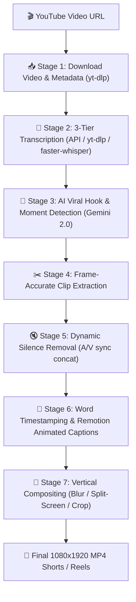

# 🎬 Clips

<div align="center">

**Autonomous AI-Powered Pipeline: Long-Form Videos → Viral Vertical Reels & Shorts**

[](https://github.com/BKiran27/ClipForge)
[](https://bun.sh/)
[](https://aistudio.google.com/)
[](https://www.remotion.dev/)
[](https://www.docker.com/)
[](https://github.com/BKiran27/ClipForge/actions)

[Features](#-features) • [Quick Start](#-quick-start) • [Web Studio](#-clips-web-studio) • [CLI Usage](#-cli-usage) • [Cloud & Docker](#-docker--cloud-hosting) • [Architecture](#-architecture)

</div>

---

## 🌟 Overview

**Clips** is a production-grade, automated content generation pipeline that takes long-form YouTube videos (podcasts, lectures, commentaries, gaming, documentaries) and extracts high-retention, viral-ready vertical clips formatted for **TikTok, YouTube Shorts, and Instagram Reels**.

It combines **Google Gemini 2.0** for psychological hook identification, **FFmpeg** for frame-accurate silence removal and split-screen video compositing, **faster-whisper** for millisecond-precision word timestamps, and **Remotion** for animated karaoke-style subtitle overlays.

---

## ✨ Features

- 🎯 **AI Viral Moment Detection**: Analyzes video transcripts using Gemini to identify compelling 30-90 second segments with high curiosity hooks, narrative payoffs, and viral scores (1-10).
- 🔄 **Smart Overlap Deduplication**: Automatically resolves overlapping segments so you always get diverse, high-performing clips.
- ✂️ **Lossless Silence Removal**: Detects pauses and dead air (`silencedetect`) and cuts them out while maintaining flawless audio-video lip sync.
- 🎨 **Multi-Layout Video Engine**:
  - **✨ Blur Background (Studio Standard)**: Centers original 16:9 video with a smooth, zoomed and blurred ambient background filling the 9:16 vertical canvas.
  - **🎮 Split-Screen (Gameplay/Satisfying)**: Stacks source lecture/podcast footage on top with Subway Surfers or satisfying background gameplay on the bottom.
  - **📐 Center Crop**: Direct 9:16 portrait framing for single-speaker content.
- 💬 **Dynamic Animated Captions**: React-powered Remotion rendering with word-by-word active highlighting (`#FFD700` gold pop), black contrast outline, and clean typography.
- ⚡ **3-Tier Resilient Transcription Engine**:
  - **Tier 1**: Instant fetch via YouTube Transcript API.
  - **Tier 2**: Fallback to `yt-dlp` subtitle extraction (bypasses IP blocks).
  - **Tier 3**: Offline local transcription with `faster-whisper` CTranslate2 (no cloud dependency required).
- 🖥️ **Interactive Web Studio**: Integrated dark-mode web dashboard with real-time stage progress, in-browser 9:16 video player, and 1-click MP4 downloads.
- 💾 **SQLite Checkpoint Persistence**: Full state recovery across crashes or restarts via WAL-mode SQLite database (`clips resume <run-id>`).

---

## 🏗️ Pipeline Architecture



---

## 🚀 Quick Start

### 1. Prerequisites

- **[Bun](https://bun.sh/)** (v1.1+)
- **[FFmpeg](https://ffmpeg.org/)** (installed and added to PATH)
- **[Python](https://www.python.org/)** (3.10+ with `pip`)
- **[Google Gemini API Key](https://aistudio.google.com/)**

### 2. Clone & Setup via Git

```bash
# Clone the repository
git clone https://github.com/BKiran27/ClipForge.git
cd ClipForge

# Install dependencies
bun install

# Install audio & transcription dependencies
pip install yt-dlp youtube-transcript-api faster-whisper
```

### 3. Set Environment Variable

Create a `.env` file in the project root:
```env
GEMINI_API_KEY=your_gemini_api_key_here
```
Or export it directly:
```bash
# Linux/macOS
export GEMINI_API_KEY="your_gemini_api_key_here"

# Windows PowerShell
$env:GEMINI_API_KEY = "your_gemini_api_key_here"
```

---

## 🖥️ Clips Web Studio

Launch the built-in visual web dashboard:

```bash
bun run serve
```

Open **[http://localhost:3000](http://localhost:3000)** in your browser:

- 🔗 Paste any YouTube URL
- 🎨 Choose your layout style: **Blur Background**, **Split-Screen**, or **Center Crop**
- ⚡ Choose max clips and speed multiplier
- 📊 Track all 7 pipeline stages live with animated indicators
- 📱 Watch the generated vertical reels in the built-in mobile viewport player
- ⬇️ Download vertical 1080×1920 MP4 files directly

---

## 💻 CLI Usage

### Generate Clips from Video

```bash
# Run with default Blur-Background layout
bun run start pipeline "https://www.youtube.com/watch?v=VIDEO_ID"

# Generate up to 3 clips with blur-background
bun run start pipeline "https://www.youtube.com/watch?v=VIDEO_ID" --layout blur-background --max-clips 3

# Generate split-screen reels (top video + bottom gameplay)
bun run start pipeline "https://www.youtube.com/watch?v=VIDEO_ID" --layout split-screen --speed 1.2
```

### Batch Process an Entire YouTube Channel

```bash
# Process latest 5 videos from a channel (skipping already completed)
bun run start batch "https://www.youtube.com/@ChannelName" --limit 5 --skip-existing
```

### Ensure Gameplay Assets

```bash
# Automatically generates procedural gameplay footage for split-screen mode
bun run start setup-assets
```

### Inspect Runs & Resume

```bash
# List all pipeline runs from database
bun run start status

# Inspect specific run details
bun run start status <run-id>

# Resume an interrupted run from where it stopped
bun run start resume <run-id>

# Clean intermediate artifacts to save disk space
bun run start clean <run-id>
```

---

## 🐳 Docker & Cloud Hosting

You can run Clips Studio anywhere using Docker (VPS, Railway, Render, Fly.io):

```bash
# Build Docker image
docker build -t clips-studio .

# Run container
docker run -p 3000:3000 -e GEMINI_API_KEY="your_api_key" clips-studio
```

Access the studio at `http://localhost:3000`.

---

## ⚙️ Configuration Reference

| Variable | Default | Description |
| :--- | :--- | :--- |
| `GEMINI_API_KEY` | *(required)* | Google Gemini API key |
| `GEMINI_MODEL` | `gemini-2.0-flash` | Gemini model (`gemini-2.0-flash`, `gemini-1.5-flash`, `gemini-2.5-flash`) |
| `LAYOUT` | `auto` | Default layout (`blur-background`, `split-screen`, `center-crop`) |
| `WHISPER_MODEL` | `base` | Whisper model size (`tiny`, `base`, `small`, `medium`, `large`) |
| `MAX_PARALLEL_CLIPS` | `3` | Parallel clip rendering concurrency (1-10) |
| `SILENCE_THRESHOLD_DB` | `-35` | Silence detection threshold in dB |
| `SILENCE_MIN_DURATION` | `0.8` | Minimum silence length to cut (seconds) |
| `CLIP_SPEED` | `1.2` | Speed ramp multiplier (1.0 - 1.5) |
| `OUTPUT_WIDTH` | `1080` | Output reel width (pixels) |
| `OUTPUT_HEIGHT` | `1920` | Output reel height (pixels) |

---

## 🧪 Testing & Code Quality

```bash
# Run all unit, pipeline, and module tests
bun test

# Run linter
bun run lint

# Format code
bun run format
bun run format:check
```

---

## 📁 Repository Structure

```
clips/
├── src/
│   ├── index.ts                 # CLI entry point (commander)
│   ├── config.ts                # Configuration schema & validation (zod)
│   ├── server/
│   │   └── index.ts             # Web Studio Dashboard server (Bun.serve)
│   ├── pipeline/
│   │   ├── orchestrator.ts      # 7-stage orchestrator with concurrency control
│   │   ├── checkpoint.ts        # SQLite WAL checkpoint manager
│   │   └── types.ts             # Pipeline data contracts
│   ├── modules/
│   │   ├── downloader.ts        # yt-dlp downloader with cookie fallback
│   │   ├── transcriber.ts       # 3-tier transcription engine
│   │   ├── clip-identifier.ts   # Gemini viral extractor & deduplicator
│   │   ├── video-processor.ts   # FFmpeg cutting, silence removal, blur/split reels
│   │   └── caption-generator.ts # Word timestamps & Remotion rendering
│   ├── remotion/
│   │   ├── CaptionOverlay.tsx   # React animated karaoke caption component
│   │   └── Root.tsx             # Remotion composition entry
│   └── utils/
│       ├── exec.ts              # Cross-platform binary detector
│       ├── assets.ts            # Gameplay asset generator
│       ├── ffmpeg.ts            # FFmpeg & ffprobe process wrappers
│       ├── fs.ts                # File system helpers
│       └── logger.ts            # Colored terminal logger
├── Dockerfile                   # Production container definition
├── .github/workflows/ci.yml     # Automated CI testing pipeline
└── package.json                 # Project configuration
```

---

## 📄 License

MIT License © 2026 [BKiran27](https://github.com/BKiran27). Free for personal and commercial content creation.
